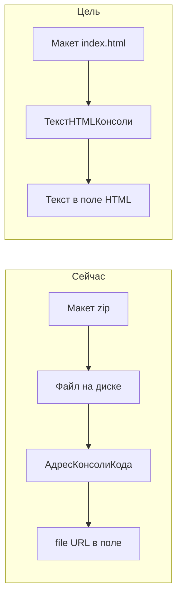

# План перехода консоли на HTML-макет и фасад

Контур: **общие модули `Расш1_*` (оба контура)**. Формы править **по волнам отдельно для XDTO и XML**, не копировать страницы и обработчики между контурами.

Источник редактора: [salexdv/bsl_console](https://github.com/salexdv/bsl_console) (ветка `webpack`). Сборка `npm run build:single` / `npm run build:pack` даёт один `dist/index.html` без внешних ссылок — его кладут в поле HTML **как текст**, как макеты OneKanban. Это обходит предупреждение 8.3.27+ «ПолеHTMLДокумента пытается открыть локальный файл».

Протокол `defaultView` + `eventData1C` **не менять** (контракт консоли). Меняем загрузку HTML и слои вокруг API.

## Сейчас vs цель

Сейчас: общий макет `bsl_console` типа `BinaryData` (zip) → `ПередНачаломРаботыСистемы` распаковывает на диск → глобальная `АдресКонсолиКода` → в реквизит поля пишется `file://`. Гонка с `ПриОткрытии`, предупреждение 8.3.27, веб-клиент почти мёртв.

Цель волны 1: макет = текст `index.html` → сервер отдаёт строку → реквизит поля HTML = текст. Без zip, без глобальной переменной, без модуля приложения для консоли.

Платформа текущего `bsl_console`: не ниже **8.3.24** (WebKit). Single-file как текст особенно нужен на **8.3.27+**. Совместимость расширения сейчас `8.3.10` — режим совместимости можно не поднимать, если нет нового синтаксиса; в README/AGENTS зафиксировать runtime **8.3.24+**, рекомендуется **8.3.27+**. Архивные ветки `webpack_0_20` / `develop_0_20` в этот переход **не брать**.

## Память: много полей на одной форме

У канбана одно поле и маленький HTML. У ПКО до ~12 полей. Если в каждый реквизит положить полный single-file (несколько МБ), форма раздуется.

Правило волны 1:

- Текст макета читать **один раз** (`ПолучитьТекстHTMLКонсоли` в `Расш1_КонсольКодаВызовСервера`).
- Кэш на форме: один реквизит вроде `Расш1_ТекстHTMLКонсоли`.
- В поле консоли копировать текст **лениво** (при открытии страницы обработчика / первом `Назначить…`), не всем 12 сразу в `ПриОткрытии`.
- Сборка: предпочтительно `npm run build:pack` (меньше размер). Проверка `npm run check:single`.

Не грузить редактор через `GetInfoBaseURL` + временное хранилище: на 8.3.27 это снова «внешний/локальный» ресурс. Только текст HTML в поле.

## Волна 1 — HTML-макет как в канбане

Общие модули, оба контура. Формы только меняют способ назначения адреса (сигнатура `НазначитьРеквизитуКонсолиАдрес`).

1. Собрать `index.html` (`build:pack`). Кладка: `vendor/bsl_console/index.html` + короткий `vendor/bsl_console/README.md` (команды сборки, версия тега/коммита upstream). Не тащить весь node-проект в git.
2. Макет `CommonTemplate.bsl_console`: с `BinaryData` на текстовый (или HTML-документ).
3. `ПолучитьМакетКонсоли()` заменить на функцию, возвращающую **строку HTML**.
4. Удалить цепочку `ИзвлечьИсходники` / zip / `АдресКонсолиКода`.
5. `НазначитьРеквизитуКонсолиАдрес`: писать текст HTML в реквизит поля (из кэша формы).
6. **Удалить VanessaEditor полностью** — макет, закомментированный код, упоминания в AGENTS.md.
7. Проверка: форма Алгоритмы (XDTO). В метаданных и поиске по репозиторию нет `VanessaEditor`.

## Волна 2 — фасад консоли (#std469, #std455, #std453)

- `Расш1_КонсольКодаКлиент` — только клиент: `defaultView`, события, тема, текст, кэш HTML.
- `Расш1_КонсольКода` — только сервер, без «Вызов сервера»: `СоздатьКонсоль`.
- `Расш1_КонсольКодаВызовСервера` — текст макета, JSON метаданных.
- При необходимости `Расш1_КонсольКодаКлиентСервер` — имена событий, конструктор состояния.

Фасад: формы не вызывают `.editor` / `.monaco`. Диспетчер `eventData1C`. Реестр консолей на форме. `ПоискНаименованияТекущейКонвертации` убрать из модуля консоли.

Пилот: `Алгоритмы.ФормаЭлемента` (только XDTO).

## Волна 3 — копипаста форм (#std492, #std630)

Порядок: Алгоритмы (XDTO) → Конвертации (XDTO) → ПОД (XDTO, страницу XML не включать) → ПКО сначала XDTO, потом XML.

- `Подключаемый_*` для HTML и команд.
- `ПередЗаписью`: цикл по реестру через фасад.

Не включать консоль на формах XML, где её ещё нет (форма конвертации XML, алгоритмы XML, ПОД XML).

## Что сознательно не делаем

- Не внедрять и не держать VanessaEditor. Редактор один — `bsl_console`.
- Не подменять `eventData1C` на `V8Proxy` из OneKanban.
- Не внедрять вкладки редактора (`createTab`) и AI inline, пока нет задачи.
