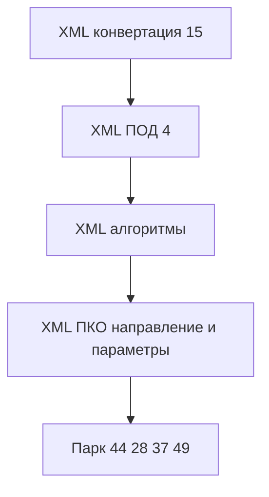

# Порядок работ по открытым issues

Проверено по [issues](https://github.com/ViktorErmakov/Conversion-3-Plus/issues) 26.09.2026.

Текущий контур: **XML**. Формы XDTO уже обслуживаются и в этой волне не переписываются. Общие `Расш1_*` менять только там, где XML-обработчику нужен тот же механизм, что уже есть у XDTO.

Источник правды: EDT-проект `Конвертация_данных_31_демо.Conversion_3_Plus`. Выгрузка конфигуратора `src/Conversion_3_Plus/` из репозитория убрана.

Отдельного issue на консоль XML нет.

---

## Открытые issues

| Issue | Роль |
|---|---|
| [#44](https://github.com/ViktorErmakov/Conversion-3-Plus/issues/44) тесты | после волны XML |
| [#28](https://github.com/ViktorErmakov/Conversion-3-Plus/issues/28) конструктор запроса | парк |
| [#37](https://github.com/ViktorErmakov/Conversion-3-Plus/issues/37) синтакс-помощник | парк |
| [#49](https://github.com/ViktorErmakov/Conversion-3-Plus/issues/49) ИИ для обработчиков | парк |

Закрыты и из активных волн убраны: [#17](https://github.com/ViktorErmakov/Conversion-3-Plus/issues/17), [#30](https://github.com/ViktorErmakov/Conversion-3-Plus/issues/30), [#33](https://github.com/ViktorErmakov/Conversion-3-Plus/issues/33), [#35](https://github.com/ViktorErmakov/Conversion-3-Plus/issues/35), [#14](https://github.com/ViktorErmakov/Conversion-3-Plus/issues/14), [#46](https://github.com/ViktorErmakov/Conversion-3-Plus/issues/46), [#47](https://github.com/ViktorErmakov/Conversion-3-Plus/issues/47). Раньше уже были закрыты #18, #24, #36, #40, #42, #43, PR #45.

---

## Что уже сделано

Общее для обоих контуров:

- HTML-макет `bsl_console` одним файлом, без zip / `file://`
- Один хост `Расш1_КонсольHTML` и реестр `Расш1_РеестрАлгоритмов`
- Форма `Расш1_НастройкиКонсолиКода`: тема (`Расш1_ТемыКонсолиКода`), насыщенность, шрифт, язык `ru`/`en`, флаг включения консоли (#17, #47)
- Запись текста с нормализацией перевода строк (#35)
- Скрипт `scripts/Update-BslConsole.ps1` (#30)
- Ленивые подсказки метаданных и тексты модулей `Расш1_ТекстыМодулей` (#33). Для XML направление выбирает релиз `Конфигурация` или `КонфигурацияКорреспондент`

Покрытие форм:

| Форма | XDTO | XML |
|---|---|---|
| Конвертации | 4 обработчика, хост на `СтраницаОбработчики` | консоли нет, 15 полей на `ОбработчикиXML` |
| ПОД | 2 обработчика, хост на `ОбработчикиСобытийXDTO` | консоли нет, 4 поля на `СтраницыОбработчикиXML` |
| Алгоритмы | поле `Алгоритм` | то же поле, консоль создаётся только при `ЭтоКонвертацияXDTO` |
| ПКО | 4 обработчика, направление и `customObjects` | 8 консолей на `ОбработчикиXML` уже есть; в `ПослеФормированияКонсолей` направление обнуляется, `ПолучитьОписаниеПараметровJSON` для XML пустой |

Консоль на XML-форме создавать при включённом флаге и заполненной ссылке `Конвертация`. Саму `bsl_console` не менять. Перехват — `&После` или `&ИзменениеИКонтроль`.

Направление на XML фиксируется стороной обработчика: выгрузка — отправка, загрузка — получение. Свободный тумблер на этих страницах не нужен.

Параметры страницы (`customObjects`) брать из подсказки обработчика на форме, по той же схеме, что `КомпонентыОбмена` / `ДанныеИБ` у XDTO.

---

## Волна XML. Конвертации

Хост на группе `ОбработчикиXML`. Имя страницы — имя вложенной группы. Реквизит формы `Конвертация` = `Объект.Ссылка`.

| Страница | Поле | Направление |
|---|---|---|
| `ПослеЗагрузкиПравилОбмена` | `АлгоритмПослеЗагрузкиПравилОбмена` | отправка |
| `ПередВыгрузкойДанных` | `АлгоритмПередВыгрузкойДанных` | отправка |
| `ПередПолучениемИзмененныхОбъектов` | `АлгоритмПередПолучениемИзмененныхОбъектов` | отправка |
| `ПередВыгрузкойОбъекта` | `АлгоритмПередВыгрузкойОбъекта` | отправка |
| `ПередОтправкойИнформацииОбУдалении` | `АлгоритмПередОтправкойИнформацииОбУдалении` | отправка |
| `ПередКонвертациейОбъекта` | `АлгоритмПередКонвертациейОбъекта` | отправка |
| `ПослеВыгрузкиОбъекта` | `АлгоритмПослеВыгрузкиОбъекта` | отправка |
| `ПослеВыгрузкиДанных` | `АлгоритмПослеВыгрузкиДанных` | отправка |
| `ПередЗагрузкойДанных` | `АлгоритмПередЗагрузкойДанных` | получение |
| `ПослеЗагрузкиПараметров` | `АлгоритмПослеЗагрузкиПараметров` | получение |
| `ПослеПолученияИнформацииОбУзлахОбмена` | `АлгоритмПослеПолученияИнформацииОбУзлахОбмена` | получение |
| `ПередЗагрузкойОбъекта` | `АлгоритмПередЗагрузкойОбъекта` | получение |
| `ПриПолученииИнформацииОбУдалении` | `АлгоритмПриПолученииИнформацииОбУдалении` | получение |
| `ПослеЗагрузкиОбъекта` | `АлгоритмПослеЗагрузкиОбъекта` | получение |
| `ПослеЗагрузкиДанных` | `АлгоритмПослеЗагрузкиДанных` | получение |

Ветка — рядом с существующим `Если КонвертацияXDTO`, в области XML. Смена страницы `ОбработчикиXML` показывает алгоритм этой страницы и подставляет её параметры.

---

## Волна XML. ПОД

Хост на `ОбработчикиСобытийXML`, страницы группы `СтраницыОбработчикиXML`. Все четыре обработчика — правила выгрузки, направление отправка.

| Страница | Поле |
|---|---|
| `ПередОбработкой` | `АлгоритмПередОбработкойПравила` |
| `ПередВыгрузкой` | `АлгоритмПередВыгрузкойОбъекта` |
| `ПослеВыгрузки` | `АлгоритмПослеВыгрузкиОбъекта` |
| `ПослеОбработки` | `АлгоритмПослеОбработкиПравила` |

`Конвертация` брать из `Параметры.Конвертация`, как на ветке XDTO.

---

## Волна XML. Алгоритмы

Поле то же: `Элементы.Алгоритм`. Снять ограничение `ЭтоКонвертацияXDTO` при включённой консоли.

Направление: `ИспользуетсяПриЗагрузке` — получение, иначе отправка. Смена флага обновляет направление и релиз подсказок.

---

## Волна XML. ПКО, добить

Хост и восемь регистраций уже есть. Доделать то, что на XDTO уже работает.

Направление по странице, тумблер скрыт:

| Страница | Поле | Направление |
|---|---|---|
| `Страница_ПередВыгрузкой` | `АлгоритмПередВыгрузкойОбъекта` | отправка |
| `Страница_ПриВыгрузке` | `АлгоритмПриВыгрузкеОбъекта` | отправка |
| `Страница_ПослеВыгрузки` | `АлгоритмПослеВыгрузкиОбъекта` | отправка |
| `Страница_ПослеВыгрузкиВФайл` | `АлгоритмПослеВыгрузкиОбъектаВФайлОбмена` | отправка |
| `Страница_ПоляПоиска` | `АлгоритмПоследовательностьПолейПоиска` | получение |
| `Страница_ПередЗагрузкой` | `АлгоритмПередЗагрузкойОбъекта` | получение |
| `Страница_ПриЗагрузке` | `АлгоритмПриЗагрузкеОбъекта` | получение |
| `Страница_ПослеЗагрузки` | `АлгоритмПослеЗагрузкиОбъекта` | получение |

`ПоследовательностьПолейПоиска` отнесена к получению: обработчик ищет объект при загрузке. В `ПолучитьОписаниеПараметровJSON` для XML заполнить `customObjects` параметрами страницы из подсказки формы.

Убрать обнуление `Направление = ""` в XML-ветке `ПослеФормированияКонсолей`.

---

## Парк

- #44 — тесты YAxUnit после XML: те же проверки хоста, что планировались для XDTO, плюс вкладки XML (конвертация 15, ПОД 4, алгоритмы, ПКО 8)
- #28 — конструктор запроса
- #37 — синтакс-помощник платформы
- #49 — ИИ для текста обработчиков

Старт: **конвертация XML**, затем ПОД, алгоритмы, добивка ПКО.
