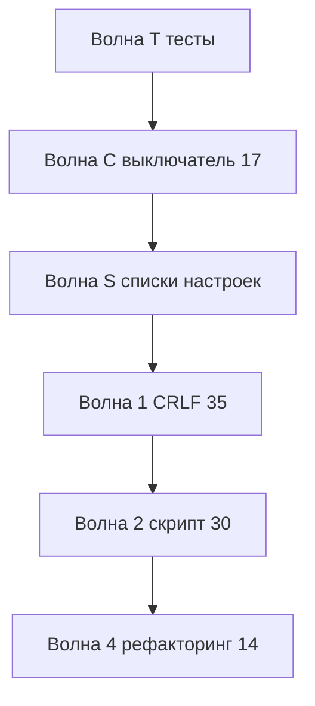

# Порядок работ по открытым issues

Источник: [github.com/ViktorErmakov/Conversion-3-Plus/issues](https://github.com/ViktorErmakov/Conversion-3-Plus/issues).

Контур по умолчанию: **XDTO**. XML не смешивать, пока явно не откроете этот контур.

Источник правды для кода: EDT-проект `Конвертация_данных_31_демо.Conversion_3_Plus`. Выгрузка `src/Conversion_3_Plus/` отстаёт — тесты и правки только из EDT.

Копия этого плана в Cursor: `C:\Users\TEENA\.cursor\plans\порядок_github_issues_a8120058.plan.md`.

C и S можно делать одной поставкой формы настроек.

---

## Открытые issues

Сегодня закрыты и из плана убраны: #18, #24, #36, #40, #42, #43, PR #45.

| Issue | Роль |
|---|---|
| [#44](https://github.com/ViktorErmakov/Conversion-3-Plus/issues/44) тесты | Волна T |
| [#17](https://github.com/ViktorErmakov/Conversion-3-Plus/issues/17) вкл/выкл консоли | Волна C |
| форма настроек (списки) | Волна S |
| [#35](https://github.com/ViktorErmakov/Conversion-3-Plus/issues/35) CRLF | Волна 1 |
| [#30](https://github.com/ViktorErmakov/Conversion-3-Plus/issues/30) скрипт макета | Волна 2 |
| [#14](https://github.com/ViktorErmakov/Conversion-3-Plus/issues/14) formhelper / БСП | Волна 4 |
| [#46](https://github.com/ViktorErmakov/Conversion-3-Plus/issues/46) зацикливание | в коде уже нет; закрыть на GitHub |
| [#28](https://github.com/ViktorErmakov/Conversion-3-Plus/issues/28), [#33](https://github.com/ViktorErmakov/Conversion-3-Plus/issues/33), [#37](https://github.com/ViktorErmakov/Conversion-3-Plus/issues/37), [#49](https://github.com/ViktorErmakov/Conversion-3-Plus/issues/49) | парк |

Консоль XML на формах конвертации / ПОД / алгоритмов в issues нет — отдельный контур.

---

## Что уже сделано

- HTML-макет `bsl_console` текстом, без zip / `file://` / VanessaEditor
- Один хост `Расш1_КонсольHTML` + реестр `Расш1_РеестрАлгоритмов`
- Форма настроек `Расш1_НастройкиКонсолиКода` (тема, шрифт, строка состояния). Флага «использовать консоль» ещё нет
- Метаданные: `ЕстьОписаниеМетаданных` + загрузка XML/EDT, без рекурсии
- На форме конвертации XDTO 4 обработчика, включая `ПередОбработкойУдаления`

---

## Волна T. Тесты при включённой консоли (#44)

YAxUnit в `Tests/yaxunit`. API `bsl_console` не проверяем. Глубина: все вкладки обработчиков.

Сейчас консоль всегда создаётся — это режим «вкл».

- Хост `Расш1_КонсольHTML`, кэш `Расш1_ТекстHTMLКонсоли`, реестр `Расш1_РеестрАлгоритмов`
- `ВсеКонсолиСформированы` истинна; HTML не `file://`
- На каждой вкладке путь данных совпадает с алгоритмом
- JSON описания релиза непустой

| Форма | Контур | Вкладки |
|---|---|---|
| Алгоритмы | XDTO | 1 |
| Конвертации | XDTO | 4 |
| ПОД | XDTO | 2; XML не открывать |
| ПКО | XDTO | 4 |
| ПКО | XML | 8 |

После волны C — зеркальные кейсы «консоль выкл».

---

## Волна C. Вкл / выкл консоли (#17)

Контур: общие модули `Расш1_*` (оба контура). Формы только читают флаг.

- **Включена (по умолчанию):** типовые поля алгоритмов скрыты, хост HTML, запись через `ЗаписатьТекстыКонсолейВОбъект`
- **Выключена:** форма как в типовой КД: штатные текстовые поля видны; хост не создаётся; `ПередЗаписью` / смена страниц / вопрос про метаданные консоли текст не трогают. Расширение остаётся включённым

Смена флага действует на следующем открытии формы.

Как хранить: не функциональная опция на всю ИБ. Флаг `ИспользоватьКонсольКода = Истина` в `НовыеНастройкиРедактора`, чекбокс на `Расш1_НастройкиКонсолиКода`. Ранний выход в `ЗарегистрироватьАлгоритм` и `СоздатьХостКонсоли`. Команды настроек остаются.

Не использовать `&Вместо`. Не патчить `bsl_console`.

Тесты: вкл — хост есть; выкл — `Расш1_КонсольHTML` нет, типовое поле видно.

---

## Волна S. Списки формы `Расш1_НастройкиКонсолиКода`

Консоль не патчить. Темы и API — [README bsl_console](https://github.com/salexdv/bsl_console/blob/webpack/README.md), `docs/switch_lang.md`.

### Тема — перечисление `Расш1_ТемыКонсолиКода`

Имя английское, синоним русский, в консоль — строка `setTheme`. Все темы API:

| Имя | Синоним | API |
|---|---|---|
| `White` | Светлая | `bsl-white` |
| `WhiteQuery` | Светлая запрос | `bsl-white-query` |
| `Dark` | Темная | `bsl-dark` |
| `DarkQuery` | Темная запрос | `bsl-dark-query` |
| `EDTWhite` | EDT светлая | `bsl-edt-white` |
| `EDTDark` | EDT темная | `bsl-edt-dark` |

Поле формы — ссылка на перечисление. Старые строки в `ДополнитьНастройкиРедактора` смапить на значения.

### Насыщенность — перечисление `Расш1_НасыщенностьШрифтаКонсоли`

| Имя | Синоним | `setFontWeight` |
|---|---|---|
| `Normal` | Обычный | `normal` |
| `Bold` | Полужирный | `bold` |
| `Lighter` | Светлее | `lighter` |
| `Bolder` | Темнее | `bolder` |

Пустое «по умолчанию»: `Default` или пустая ссылка — тогда `setFontWeight` не вызывать.

### Высота строки

Не список. Число для `setLineHeight`: `0` = дефолт консоли, иначе любое положительное. Подсказка: обычно 16–32, 0 — по умолчанию.

### Размер шрифта

Не список. Число, `0` = дефолт. Подсказка элемента: обычно 8–24, 0 — по умолчанию.

### Семейство шрифтов

- Готовый список: Consolas, Courier New, Lucida Console, Cascadia Mono, Fira Code, JetBrains Mono + «по умолчанию»
- Не веб-клиент: кнопка «Выбрать…» → `ДиалогВыбораШрифта.Показать`. Из `Шрифт` заполнить имя, размер, насыщенность
- Веб-клиент: только список, кнопку скрыть

### Язык подсказок

`switchLang` принимает только `ru` и `en`. Список из `Метаданные.Языки` (код + синоним) или `СтандартныеПодсистемыСервер.ЯзыкиКонфигурации()`. Оставить только `ru`/`en`. Если язык один — поле скрыть, как на форме пользователей.

### Контекст редактора

Убрать с формы. В `ПрименитьНастройкиРедактора` всегда `setContextMode("Server")`.

---

## Волна 1. #35 CRLF

Нормализовать `\n` → `\r\n` в одном месте при записи из хоста в реквизит. Только режим «консоль вкл».

## Волна 2. #30

Скрипт: `npm run build:pack` → `vendor/bsl_console/index.html` → макет `Template.txt`. Шаги уже в `vendor/bsl_console/README.md`.

## Волна 4. #14

Создание элементов хоста через БСП / formhelper. При выключенной консоли этот код не вызывается.

## Парк

- #46 — закрыть комментарием: рекурсии нет
- #28, #33, #37, #49
- Консоль XML на остальных формах

---

Рекомендуемый старт: **волна T**, затем **C (#17)** и **S (настройки)**.
