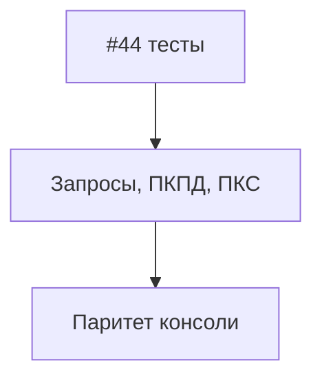

# Оставшиеся работы

Проверено по коду расширения 03.10.2026. Волна XML (конвертация, ПОД, алгоритмы, добивка ПКО) сделана. Глобальный поиск по правилам, алгоритмам и модулям сделан. Без консоли остались вкладка «Запросы», XML-форма предопределённых данных и обе формы свойств.

Дальше контур такой: сначала тесты [#44](https://github.com/ViktorErmakov/Conversion-3-Plus/issues/44), затем эти формы, затем паритет общих `Расш1_*` для обоих типов конвертации. Саму `bsl_console` не менять. Зависимость от Infostart Toolkit не тащить.

```mermaid
flowchart TD
  tests["#44 тесты"]
  forms["Запросы, ПКПД, ПКС"]
  parity[Паритет консоли]
  tests --> forms --> parity
```

Открыт только [#44](https://github.com/ViktorErmakov/Conversion-3-Plus/issues/44). Закрыты и в работу не возвращаются: [#28](https://github.com/ViktorErmakov/Conversion-3-Plus/issues/28) конструктор запроса, [#37](https://github.com/ViktorErmakov/Conversion-3-Plus/issues/37) синтакс-помощник, [#49](https://github.com/ViktorErmakov/Conversion-3-Plus/issues/49) ИИ для обработчиков.

## Откуда берём разрывы

Три консоли на одном редакторе. В работу попадает только то, чего нет у Conversion 3 Plus и что делается штатным API или логикой форм КД.

| Консоль | Что это | Откуда подсказки |
|---|---|---|
| [Conversion 3 Plus, 1289837](https://infostart.ru/1c/tools/1289837/) | Своя обёртка, без Toolkit и без правки HTML | Справочники КД и регистр `Расш1_ТекстыМодулей` |
| [Бустер КД 3, 1499859](https://infostart.ru/marketplace/1499859/) | Тот же редактор через Infostart Toolkit | Каталог выгрузки релиза |
| [TipsInCD3](https://github.com/GenVP/TipsInCD3) | Статьи на Инфостарте нет. Консоль патчит двумя методами, это не переносим | Индекс методов из исходников, выбор релиза на странице обработчика |

Редакторы КД 2 в список не входят.

## #44. Тесты

YAxUnit после готовой волны XML: хост консоли и вкладки XML (конвертация 15, ПОД 4, алгоритмы, ПКО 8). Когда появятся консоли ниже — туда же `ТекстЗапроса`, обработчики ПКПД и ПКС.

## Запросы

Оба контура, XDTO и XML. Вкладка «Запросы» в `НастройкаПравилОбмена` открывает элемент `Справочник.Запросы`. Поле `ТекстЗапроса` — текстовый документ. Справочник в расширении заимствован, формы элемента нет, консоли нет.

- Консоль на `ТекстЗапроса`. Режим `setLanguageMode('bsl_query')`, подсказки полей из метаданных релиза — тот же приём, что в пункте «Редактор запроса». Платформенный конструктор остаётся закрытым [#28](https://github.com/ViktorErmakov/Conversion-3-Plus/issues/28).
- Параметров обработчика у этой формы нет. Макет `ПараметрыОбработчиков` текст запроса не описывает, в `customObjects` список страницы не кладём.
- Глобальный поиск уже читает `ТекстЗапроса` и открывает `Справочник.Запросы.Форма.ФормаЭлемента`. Форма не слушает `Расш1_ПереходКВхождению`, хоста консоли нет, фраза не выделяется. После консоли — тот же переход, что у алгоритмов: оповещение, `revealLineInCenter` и `setSelection` на строке вхождения.

## ПКПД и ПКС

Контур XML. У каждой новой консоли имена параметров берутся из макета `ВыгрузкаОбработчиковXML.ПараметрыОбработчиков`, область на событие, целиком, вместе с `ФайлОбмена`. Список кладётся в `customObjects` через `ОписаниеПараметровСтраницыJSON`. Описание объекта релиза — у `Источник` и `Объект`, остальные имена с пустым описанием. Подсказка формы шире макета, в подсказку кода её не копировать. `Расш1_ИменаПараметровПКО` с областями `ПКО_*` не совпадает, для ПКПД его не копировать.

`ФормаЭлементаXDTO` предопределённых данных — сопоставление значений, полей кода нет, консоль туда не ставить.

Справочники в расширении заимствованы, модулей форм нет.

### ПравилаКонвертацииПредопределенныхДанных, `ФормаЭлементаXML`

Семь полей, области макета те же, что у ПКО. Страницы `ПоследовательностьПолейПоиска` на форме нет.

- Перед выгрузкой, `ПКО_ПередВыгрузкойОбъекта`: `ФайлОбмена`, `Источник`, `ВходящиеДанные`, `ИсходящиеДанные`, `ИмяПКО`, `ПКО`, `ВыгруженныеОбъекты`, `Отказ`, `КлючВыгружаемыхДанных`, `ЗапоминатьВыгруженные`, `НеЗамещатьОбъектПриЗагрузке`, `ВсеОбъектыВыгружены`, `ТолькоПолучитьУзелСсылки`, `Приемник`, `РежимЗаписи`, `РежимПроведения`, `НеСоздаватьЕслиНеНайден`.
- При выгрузке, `ПКО_ПриВыгрузкеОбъекта`: `ФайлОбмена`, `Источник`, `ВходящиеДанные`, `ИсходящиеДанные`, `ИмяПКО`, `ПКО`, `ВыгруженныеОбъекты`, `КлючВыгружаемыхДанных`, `Отказ`, `СтандартнаяОбработка`, `Приемник`, `УзелСсылки`.
- После выгрузки, `ПКО_ПослеВыгрузкиОбъекта`: `ФайлОбмена`, `Источник`, `ВходящиеДанные`, `ИсходящиеДанные`, `ИмяПКО`, `ПКО`, `ВыгруженныеОбъекты`, `КлючВыгружаемыхДанных`, `Отказ`, `Приемник`, `УзелСсылки`.
- После выгрузки в файл, `ПКО_ПослеВыгрузкиОбъектаВФайлОбмена`: `ФайлОбмена`, `Источник`, `ВходящиеДанные`, `ИсходящиеДанные`, `ИмяПКО`, `ПКО`, `ВыгруженныеОбъекты`, `Приемник`, `УзелСсылки`.
- Перед загрузкой, `ПКО_ПередЗагрузкойОбъекта`: `ФайлОбмена`, `Отказ`, `Нпп`, `Источник`, `ИмяПравила`, `Правило`, `ГенерироватьНовыйНомерИлиКодЕслиНеУказан`, `ТипОбъектаСтрокой`, `ТипОбъекта`, `НеЗамещатьОбъект`, `РежимЗаписи`, `РежимПроведения`.
- При загрузке, `ПКО_ПриЗагрузкеОбъекта`: `ФайлОбмена`, `ОбъектНайден`, `Объект`, `НеЗамещатьОбъект`, `ОбъектМодифицирован`.
- После загрузки, `ПКО_ПослеЗагрузкиОбъекта`: `ФайлОбмена`, `Отказ`, `Ссылка`, `Объект`, `ПараметрыОбъекта`, `ОбъектМодифицирован`, `ИмяТипаОбъекта`, `ОбъектНайден`.

Поиск эти поля уже читает, имя формы пустое. Открывать `Справочник.ПравилаКонвертацииПредопределенныхДанных.Форма.ФормаЭлементаXML` и выделять фразу тем же переходом, что у алгоритмов.

### ПравилаКонвертацииСвойств

Консоль только на `ГруппаXML`. У элемента и группы одинаковые имена полей `АлгоритмПередВыгрузкойСвойства`, `АлгоритмПриВыгрузкеСвойства`, `АлгоритмПослеВыгрузкиСвойства`, списки параметров разные. Области макета разные: `ПКС_*` и `ПКГС_*`.

Элемент, `ФормаЭлемента`:

- Перед выгрузкой, `ПКС_ПередВыгрузкойСвойства`: `ФайлОбмена`, `Источник`, `Приемник`, `ВходящиеДанные`, `ИсходящиеДанные`, `ПКС`, `ПКО`, `ОбъектКоллекции`, `Отказ`, `Значение`, `ТипПриемника`, `ИмяПКО`, `ИмяПКОВидСубконто`, `Пусто`, `Выражение`, `УзелКоллекцииСвойств`, `НеЗамещать`, `ВыгрузитьОбъект`.
- При выгрузке, `ПКС_ПриВыгрузкеСвойства`: `ФайлОбмена`, `Источник`, `Приемник`, `ВходящиеДанные`, `ИсходящиеДанные`, `ПКС`, `ПКО`, `ОбъектКоллекции`, `Отказ`, `Значение`, `КлючИЗначение`, `ВидСубконто`, `Субконто`, `Пусто`, `ИмяПКО`, `ПКОСвойств`, `УзелСвойства`, `УзелКоллекцииСвойств`, `ИмяПКОВидСубконто`, `ВыгрузитьОбъект`.
- После выгрузки, `ПКС_ПослеВыгрузкиСвойства`: `ФайлОбмена`, `Источник`, `Приемник`, `ВходящиеДанные`, `ИсходящиеДанные`, `ПКС`, `ПКО`, `ОбъектКоллекции`, `Отказ`, `Значение`, `КлючИЗначение`, `ВидСубконто`, `Субконто`, `ИмяПКО`, `ИмяПКОВидСубконто`, `ПКОСвойств`, `УзелСвойства`, `УзелСсылки`, `УзелКоллекцииСвойств`, `УзелСубконто`.

Группа, `ФормаГруппы`:

- Перед обработкой, `ПКГС_ПередОбработкойВыгрузки`: `ФайлОбмена`, `Источник`, `Приемник`, `ВходящиеДанные`, `ИсходящиеДанные`, `ПКО`, `ПКГС`, `Отказ`, `КоллекцияОбъектов`, `НеЗамещать`, `УзелКоллекцииСвойств`, `НеОчищать`.
- Перед выгрузкой, `ПКГС_ПередВыгрузкойСвойства`: `ФайлОбмена`, `Источник`, `Приемник`, `ВходящиеДанные`, `ИсходящиеДанные`, `ПКО`, `ПКГС`, `Отказ`, `ОбъектКоллекции`, `УзелКоллекцииСвойств`, `УзелКоллекцииОбъектов`.
- При выгрузке, `ПКГС_ПриВыгрузкеСвойства`: `ФайлОбмена`, `Источник`, `Приемник`, `ВходящиеДанные`, `ИсходящиеДанные`, `ПКО`, `ПКГС`, `ОбъектКоллекции`, `УзелКоллекцииОбъектов`, `УзелОбъектаКоллекции`, `УзелКоллекцииСвойств`, `СтандартнаяОбработка`.
- После выгрузки, `ПКГС_ПослеВыгрузкиСвойства`: `ФайлОбмена`, `Источник`, `Приемник`, `ВходящиеДанные`, `ИсходящиеДанные`, `ПКО`, `ПКГС`, `Отказ`, `ОбъектКоллекции`, `УзелКоллекцииОбъектов`, `УзелКоллекцииСвойств`, `УзелОбъектаКоллекции`.
- После обработки, `ПКГС_ПослеОбработкиВыгрузки`: `ФайлОбмена`, `Источник`, `Приемник`, `ВходящиеДанные`, `ИсходящиеДанные`, `ПКО`, `ПКГС`, `Отказ`, `УзелКоллекцииСвойств`, `УзелКоллекцииОбъектов`.

Поиск читает все пять полей и всегда открывает форму элемента. Для группы открывать `ФормаГруппы`, иначе вхождение в обработчике группы не выделить.

## Паритет консоли

У каждого пункта: что видит разработчик правил, зачем это при обмене, какой вызов консоли, у кого из трёх это есть.

- Контекст обработчика. В подсказке параметры страницы, алгоритмы, запросы и параметры конвертации, чтобы не помнить сигнатуру и не искать имя по справочнику. Тот же JSON, что уже кормит `customObjects`, плюс `updateCustomFunctions` и `setCustomSignatures`. Типы локальных переменных редактор выводит сам. Параметры страницы XML ПКО уже отдаются, этого мало. Есть у бустера.
- Редактор запроса. Поле текста запроса переключается `setLanguageMode('bsl_query')`, подсказки полей берутся из уже загруженных метаданных релиза. Это не конструктор из #28: `EVENT_QUERY_CONSTRUCT` есть, но платформенный конструктор видит только базу КД. Есть у бустера.
- Переход к определению алгоритма и запроса. `setOption('generateDefinitionEvent', true)`, по `EVENT_GET_DEFINITION` открывается элемент справочника. Внутри текущего текста остаются `revealDefinition` и `goToFuncDefinition`. Есть у бустера.
- Закладки строк на время открытой формы: `addBookmark`, `getBookmarks`, `goNextBookmark`, `goPreviousBookmark`. Команды на нашей панели, контекстное меню редактора не дописываем. Есть у бустера.
- Подсветка правок с момента открытия: `setOriginalText` кладёт исходный текст, редактор рисует виджет изменений. Режим `compare` для двух произвольных текстов не используем. Есть у бустера.
- Английские подписи параметров обработчика, когда `ЯзыкПодсказок = en`. Наши строки в том же JSON подсказок. Переключение встроенного языка редактора уже делает `switchLang`. Есть у бустера.
- Свойства `ОбъектXDTO`, контур XDTO. Свойства пакета формата кладутся в `customObjects` параметра обработчика. `setObjectContext` не подходит: он подставляет реквизиты только у `ЭтотОбъект`. Есть у бустера.
- Выбор релиза подсказки, если у конвертации их несколько. Реквизит формы и тот же `EVENT_GET_METADATA`. По умолчанию XDTO — `Конфигурация`, XML — сторона обработчика. Есть у TipsInCD3.
- Страница единственного заполненного обработчика. Пустые обработчики не активировать. Если заполнен один — открыть его страницу. Логика формы, к консоли не обращается. Есть у бустера.

Методы общих модулей, объекта и менеджера берутся из `Расш1_ТекстыМодулей`. Отдельная задача появится только если по факту не всплывают методы менеджера или объекта: тогда добрать их в тот же регистр, без разбора исходников на лету.

## Не делаем

Без правки HTML/JS редактора этого нет, в работу не ставим:

- Два метода, которые TipsInCD3 вшивает в `bsl_console`.
- Свой разбор типов локальных переменных сверх того, что редактор уже делает по `Новый`, присваиванию и результату метода.
- F12 внутрь текста чужого модуля. `parseMetadataModule` даёт список экспортных методов в подсказке. `goToFuncDefinition` ищет процедуру только в текущем тексте. `EVENT_GET_DEFINITION` сообщает имя, место в чужом модуле редактор не принимает.
