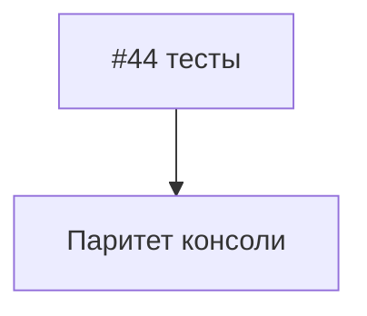

# Оставшиеся работы

Проверено по коду расширения 10.10.2026. Сделаны и из плана убраны: консоли на «Запросах», XML-форме предопределённых данных и обеих формах свойств; переход к определению алгоритма и запроса (`EVENT_GET_DEFINITION`); свойства `ДанныеXDTO` в `customObjects`; контекст обработчика — алгоритмы и запросы как функции (`updateCustomFunctions`, `setCustomSignatures`) в том же JSON, что кормит `customObjects`. Текст запроса остаётся в режиме кода: в поле бывает не только запрос.

Дальше: сначала тесты [#44](https://github.com/ViktorErmakov/Conversion-3-Plus/issues/44), затем паритет общих `Расш1_*` для обоих типов конвертации. Саму `bsl_console` не менять. Зависимость от Infostart Toolkit не тащить.

```mermaid
flowchart TD
  tests["#44 тесты"]
  parity[Паритет консоли]
  tests --> parity
```

Открыт только [#44](https://github.com/ViktorErmakov/Conversion-3-Plus/issues/44). Закрыты и в работу не возвращаются: [#28](https://github.com/ViktorErmakov/Conversion-3-Plus/issues/28) конструктор запроса, [#37](https://github.com/ViktorErmakov/Conversion-3-Plus/issues/37) синтакс-помощник, [#49](https://github.com/ViktorErmakov/Conversion-3-Plus/issues/49) ИИ для обработчиков.

## Откуда берём разрывы

Три консоли на одном редакторе. В работу попадает только то, чего нет у Conversion 3 Plus и что делается штатным API или логикой форм КД.

| Консоль | Что это | Откуда подсказки |
|---|---|---|
| [Conversion 3 Plus, 1289837](https://infostart.ru/1c/tools/1289837/) | Своя обёртка, без Toolkit и без правки HTML | Справочники КД и регистр `Расш1_ТекстыМодулей` |
| [Бустер КД 3, 1499859](https://infostart.ru/marketplace/1499859/) | Тот же редактор через Infostart Toolkit | Каталог выгрузки релиза |
| [TipsInCD3](https://github.com/GenVP/TipsInCD3) | Статьи на Инфостарте нет. Консоль патчит двумя методами, это не переносим | Индекс методов из исходников, выбор релиза на странице обработчика |

Редакторы КД 2 в список не входят.

## #44. Тесты

YAxUnit. Хост консоли и вкладки, где консоль уже стоит: XDTO и XML, включая конвертацию, ПОД, алгоритмы, ПКО, запросы, ПКПД и ПКС. Проверяем, что редактор на форме собрался и метаданные загрузились. Методы API самой консоли не проверяем.

## Паритет консоли

У каждого пункта: что видит разработчик правил, зачем это при обмене, какой вызов консоли, у кого из трёх это есть.

- Закладки строк на время открытой формы: `addBookmark`, `getBookmarks`, `goNextBookmark`, `goPreviousBookmark`. Команды на нашей панели, контекстное меню редактора не дописываем. Есть у бустера.
- Подсветка правок с момента открытия: `setOriginalText` кладёт исходный текст, редактор рисует виджет изменений. Режим `compare` для двух произвольных текстов не используем. Есть у бустера.
- Английские подписи параметров обработчика, когда `ЯзыкПодсказок = en`. Наши строки в том же JSON подсказок. Переключение встроенного языка редактора уже делает `switchLang`. Есть у бустера.
- Выбор релиза подсказки, если у конвертации их несколько. Реквизит формы и тот же `EVENT_GET_METADATA`. По умолчанию XDTO — `Конфигурация`, XML — сторона обработчика. Есть у TipsInCD3.
- Страница единственного заполненного обработчика. Пустые обработчики не активировать. Если заполнен один — открыть его страницу. Логика формы, к консоли не обращается. Есть у бустера.

Методы общих модулей, объекта и менеджера берутся из `Расш1_ТекстыМодулей`. Отдельная задача появится только если по факту не всплывают методы менеджера или объекта: тогда добрать их в тот же регистр, без разбора исходников на лету.

## Не делаем

- Текст справочника `Запросы` в режиме `bsl_query`. В поле бывает код, консоль остаётся в режиме `bsl`. Платформенный конструктор по-прежнему закрыт [#28](https://github.com/ViktorErmakov/Conversion-3-Plus/issues/28).
- Два метода, которые TipsInCD3 вшивает в `bsl_console`.
- Свой разбор типов локальных переменных сверх того, что редактор уже делает по `Новый`, присваиванию и результату метода.
- F12 внутрь текста чужого модуля. `parseMetadataModule` даёт список экспортных методов в подсказке. `goToFuncDefinition` ищет процедуру только в текущем тексте. `EVENT_GET_DEFINITION` сообщает имя, место в чужом модуле редактор не принимает.
