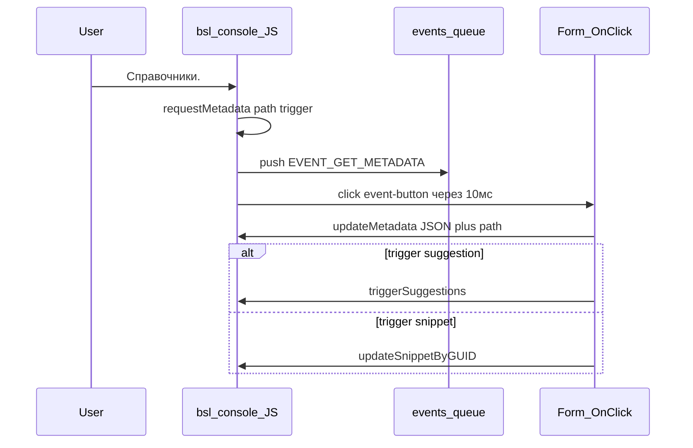

# Подсказки консоли кода

Контур: общие модули `Расш1_*` (оба контура). Саму консоль (`bsl_console`) не менять.

Источник демки: внешняя обработка `console.epf` из релизов [salexdv/bsl_console](https://github.com/salexdv/bsl_console) (форма `Форма`, обработчик `ConsoleOnClick`). API: [README](https://github.com/salexdv/bsl_console/blob/webpack/README.md), [docs/get_metadata_event.md](https://github.com/salexdv/bsl_console/blob/webpack/docs/get_metadata_event.md), [docs/update_metadata.md](https://github.com/salexdv/bsl_console/blob/webpack/docs/update_metadata.md).

## Два слоя подсказок

Подсказки — не один JSON на старте формы.

1. **Встроенные** Monaco / `bsl_console`: глобальные функции, конструкторы, типы вроде `ТипВсеСсылки`. Живут в редакторе, 1С не спрашивают.
2. **Метаданные конфигурации** — лениво, по событию `EVENT_GET_METADATA`. Пока `updateMetadata` ни разу не положил нужный путь, редактор не знает `Справочники.Номенклатура`.

Пустая ссылка `Форма["Конвертация"]` даёт пустой JSON по релизам. Тогда остаётся только слой 1. Сначала проверять конвертацию, потом запросы и JSON.

## Цепочка `EVENT_GET_METADATA`



Старт редактора в демке (`ИнициализацияРедактора` / `ОбнулитьМетаданные`):

- `init(ВерсияПриложения)`
- `clearMetadata()` — структура метаданных пустая
- сразу кладут только имена общих модулей: `updateMetadata(..., "commonModules.items")`

У нас то же: `init`, `clearMetadata`, `generateModificationEvent`. Общие модули конфигурации КД в консоль не грузим — подсказки объектов и модулей берутся из релиза конвертации, не из самой КД.

Для **XDTO** релиз всегда `Конфигурация` этой конвертации: обработчики выполняются в одной прикладной конфигурации и при отправке, и при получении. Кнопка направления меняет только `КомпонентыОбмена` (и набор customObjects по странице), а не релиз для `Справочники.` / текстов модулей. Для **XML** направление по-прежнему выбирает `Конфигурация` или `КонфигурацияКорреспондент`.

Дальше ленивая догрузка. Параметры события:

- `params.metadata` — путь в нижнем регистре (`справочники`, `справочники.номенклатура`)
- `params.trigger` — `suggestion` или `snippet`
- при `snippet` ещё `params.snippet_guid`

Разбор пути:

- нет точки (`справочники`) — список **имён без реквизитов**, `path` = `catalogs.items`
- есть точка (`справочники.номенклатура`) — тело объекта, `path` = `catalogs.items.Номенклатура`
- `module.Имя` / `module.manager|object....` — тексты из регистра `Расш1_ТекстыМодулей`, затем `parseCommonModule` / `parseMetadataModule`

После успешного `updateMetadata`:

- `trigger = suggestion` → `triggerSuggestions()`
- `trigger = snippet` → `updateSnippetByGUID(snippet_guid)`

JS кэширует запрос в `window.metadataRequests`: повторно тот же путь не шлёт. Если 1С не смогла ответить, кэш сбросить (`metadataRequests.delete` / `clear`), иначе подсказка молчит навсегда. У нас: `СброситьКэшЗапросаМетаданных`.

## JSON и `path` для `updateMetadata`

Список коллекции (только имена):

```json
{ "Номенклатура": {}, "Банки": {} }
```

`path`: `catalogs.items` (не корень JSON).

Тело объекта:

```json
{
  "properties": {
    "Код": { "name": "Код" },
    "Валюта": { "name": "Валюта", "ref": "catalogs.Валюты" },
    "Товары": { "name": "ТЧ: Товары" }
  },
  "tabulars": {
    "Товары": {
      "properties": {
        "Номенклатура": { "name": "Номенклатура", "ref": "catalogs.Номенклатура" }
      }
    }
  },
  "resources": {},
  "predefined": {}
}
```

`path`: `catalogs.items.Номенклатура`. У регистров ещё `type` (`periodical` / `nonperiodical` / `balance` / `turnovers`).

| Параметр события `metadata` | `path` для `updateMetadata` |
|---|---|
| справочники / catalogs | catalogs.items |
| документы / documents | documents.items |
| регистрысведений / informationregisters | infoRegs.items |
| регистрынакопления / accumulationregisters | accumRegs.items |
| регистрыбухгалтерии / accountingregisters | accountRegs.items |
| регистрырасчета / calculationregisters | calcRegs.items |
| обработки / dataprocessors | dataProc.items |
| отчеты / reports | reports.items |
| перечисления / enums | enums.items |
| планысчетов / chartsofaccounts | chartsOfAccounts.items |
| бизнеспроцессы / businessprocesses | businessProcesses.items |
| задачи / tasks | tasks.items |
| планыобмена / exchangeplans | exchangePlans.items |
| планывидовхарактеристик / chartsofcharacteristictypes | chartsOfCharacteristicTypes.items |
| планывидоврасчета / chartsofcalculationtypes | chartsOfCalculationTypes.items |
| константы / constants | constants.items |
| справочники.номенклатура | catalogs.items.Номенклатура |
| документы.\<Имя\> | documents.items.\<Имя\> |

Полная таблица — в [docs/update_metadata.md](https://github.com/salexdv/bsl_console/blob/webpack/docs/update_metadata.md).

## Откуда у нас данные

То же API, другой источник. Не `Метаданные` текущей ИБ, а справочники КД `Объекты` / `Свойства` по релизу из `Форма["Конвертация"]` (`РелизыКонвертацииДляМетаданных`: XDTO — всегда `Конфигурация`).

Модули:

- `Расш1_КоллекцияМетаданных` — список имён и тело объекта
- `Расш1_КонсольКодаВызовСервера.ПолучитьОписаниеОбъектаМетаданныхJSON` — релиз конвертации, JSON + `АдресОбновления`
- `Расш1_КонсольКодаКлиент.ОбработкаСобытияПолученияМетаданных` — `updateMetadata` и повторный показ списка
- смена направления не вызывает `clearMetadata` — обновляются только customObjects формы

Пользовательские списки демки (`showCustomSuggestions`, сниппеты, 1С:Напарник) не используем.

## Как читаются события

В JS редактора (`src/editor.js`):

```javascript
window.events_queue = [];
window.sendEvent = function(eventName, eventParams) {
  window.events_queue.push({event: eventName, params: eventParams});
  setTimeout(() => { document.getElementById('event-button').click(); }, 10);
};
// document.onclick на #event-button:
let eventData1C = window.events_queue.shift();
e.eventData1C = eventData1C;
```

Одно нажатие скрытой кнопки снимает **один** элемент очереди и кладёт его в `ДанныеСобытия.Event.eventData1C`. Остальное остаётся в JS-массиве. Каждый `sendEvent` планирует свой click через 10 мс.

Демка в `ConsoleOnClick` берёт только это одно событие и очередь из 1С не трогает. Следующие события приходят следующими `ПриНажатии`. Поля `event` / `params` читаются сразу в локальные переменные, без повторных хождений в внешний объект после `updateMetadata`.

Нам очередь нужна: в одном `ПриНажатии` могут лежать и `EVENT_CONTENT_CHANGED`, и `EVENT_GET_METADATA`. Поэтому:

1. Скопировать `eventData1C` в нативную структуру 1С (`event`, `params`).
2. Снять хвост `defaultView.events_queue` тем же копированием в `Массив`, **без обработки**.
3. Обойти массив и только тогда вызывать обработчики.

Нельзя в цикле `Очередь.length` / `Очередь.shift()` сразу вызывать `updateMetadata` / `triggerSuggestions`: это снова JS, очередь меняется, COM-обёртка события протухает.
